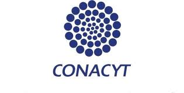

# RegulonDB Funding

The development of RegulonDB is currently funded by:

- The National Autonomous University of Mexico (UNAM) at the Center for Genomic Sciences.

Through the years it has been funded by:

- The National Autonomous University of Mexico (UNAM) at the Center for Genomic Sciences.  It has also indirectly benefited from  fellowships to students and posdocs supported by UNAM.

- The National Institutes of Health (NIH) National Center of General Medical Sciences:  
 
   - RegulonDB Development: GM071962,   
   - RegulonDB Curation: RegulonDB grant GM071962 and EcoCyc grant GM077678.  
   - New grants numbers GM077678 and 5RO1GM131643.   

- Consejo Nacional de Ciencia y Tecnologia (CONACyT), Mexico (83686 G.I., CB2008-103686-Q, PROINNOVA-134817) and Funding for open access charge: Consejo Nacional de Ciencia y Tecnologia (CONACyT), Mexico (CB2008-103686-Q). RegulonDB has also benefited from fellowships to Ph.D. and posdocs by CONACyT.

 

 <table style="border:0px">
  <tr>
    <th></th>
    <th></th>
    <th></th>
  </tr>
 </table> 

