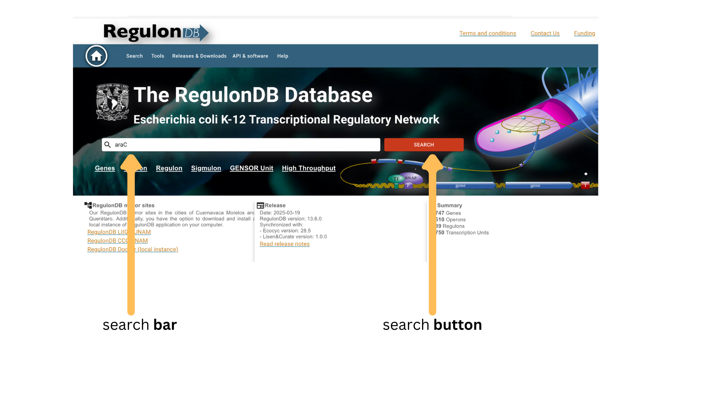
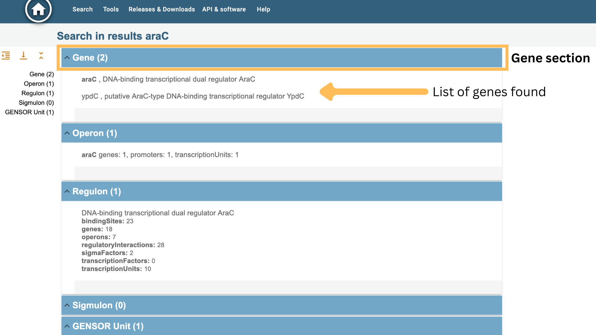
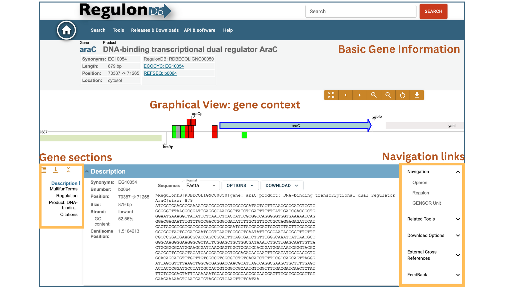

# 🧬 Gene Search Guide

Welcome to the **Gene Search Guide** of RegulonDB.

This guide explains how to retrieve gene-related information using the **global search bar** in the RegulonDB web interface.

## 📚 How Gene Search Works

RegulonDB uses a **unified search bar** that allows users to search across multiple biological entities simultaneously.

When you enter a search term, RegulonDB searches for matches across:

- Genes
- Operons
- Regulons
- Sigmulons
- GENSOR Units

If your search term matches a gene (by name, synonym, locus tag, or product name keyword), the result will be listed under the **Gene** category.

| Field             | Description |
|:------------------|:------------|
| **Gene Name**      | Commonly accepted name (e.g., `lacZ`, `crp`). |
| **Synonyms**       | Alternative names or symbols used in literature. |
| **Locus Tag**      | Unique identifier assigned to the gene (e.g., `b0344`). |
| **Product name**       | Functional description keywords (e.g., `galactose-1-epimerase`). |
| **Regulator**      | Name of a transcription factor regulating the gene (e.g., `CRP`). |
| **RegulonDB ID** | RegulonDB Gene identifier (e.g. `RDBECOLIGNC00433` ) |

You can search using partial matches, full terms, or combine multiple fields using logical operators.

➡️ See [Using Logical Operators](logical_operators_search.md) for advanced search techniques.

## 🔎 How to Perform a Gene Search

1. Open the RegulonDB homepage.
2. Enter your query (gene name, synonym, locus tag, or keyword) into the **Search Bar**.

3. Press the **Search** button.
4. Review the categorized search results.
5. Click on a gene name to access its detailed page.

## 📋 Information Available on a Gene Page

When selecting a gene from the search results, you will see the following sections:

### 🧬 Basic Gene Information
- **Gene Name** (linked to internal resources)
- **Product Description** (e.g., DNA-binding transcriptional regulator)
- **Synonyms** (alternative names and IDs)
- **Identifiers:**  
  - RegulonDB ID
  - EcoCyc ID
  - RefSeq ID
- **Gene Location:**  
  - Chromosomal coordinates
  - Strand (forward/reverse)
  - GC content
  - Genomic centisome position

### 🧬 Gene Context and Navigation
- **Graphical View:**  
  Visualization of the gene, nearby promoters, transcription units, and neighbor genes.
- **Navigation Links:**  
  Direct access to associated Operons, Regulons, and GENSOR Units.

## 📑 Detailed Sections in the Gene Page

### 📄 Description
- Basic data about the gene and its sequence.
- Download options in different formats (FASTA, GenBank).
- Centisome position and sequence properties.

### 🏷️ Multifun Terms
- Functional categorization according to Multifun ontology.

### ⚙️ Regulation
- Overview of regulatory elements:
  - **Operons** including the gene
  - **Promoters** regulating the gene
  - **Regulators** (transcription factors) acting on the gene

### 🧬 Product Information
- Detailed description of the protein product.
- Molecular weight.
- Cellular location.
- Sequence with annotations.

### 🧬 Gene Ontology (GO) Terms
- **Cellular Component**, **Molecular Function**, and **Biological Process** terms associated with the gene.

### 🧬 Motifs
- Functional motifs, conserved domains.

### 🔗 External Cross-References
- Links to external databases like UniProt, PDB, AlphaFold, EcoCyc, and others.

### 📚 Citations
- Scientific references supporting the gene annotation.

## 🛠️ Tips for Effective Gene Searches

- Use exact gene names when possible.
- Try synonyms or functional keywords if the primary name does not yield results.
- Explore the gene page fully to discover all regulatory and functional contexts.

## 📬 Need Help?

If you have questions or need assistance with the gene search or navigation, please contact:

📧 [regulondb@ccg.unam.mx](mailto:regulondb@ccg.unam.mx)

