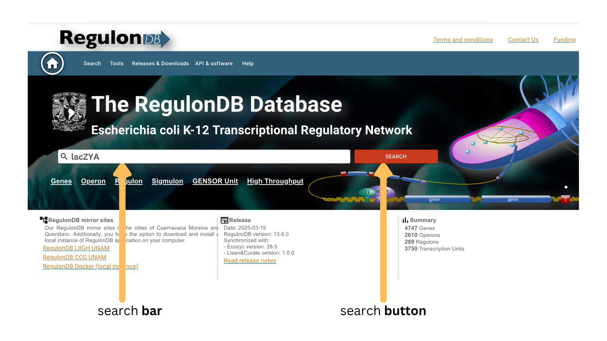
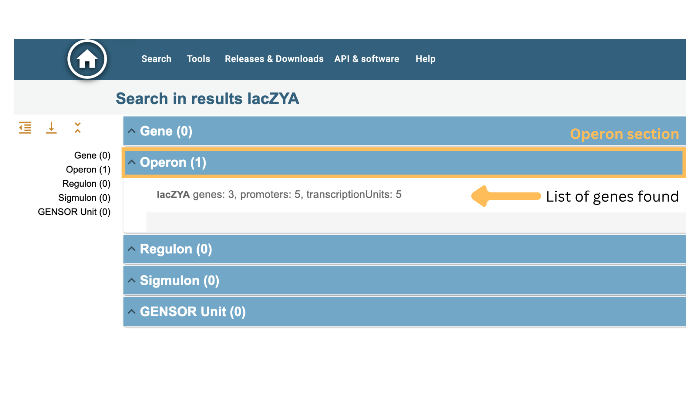
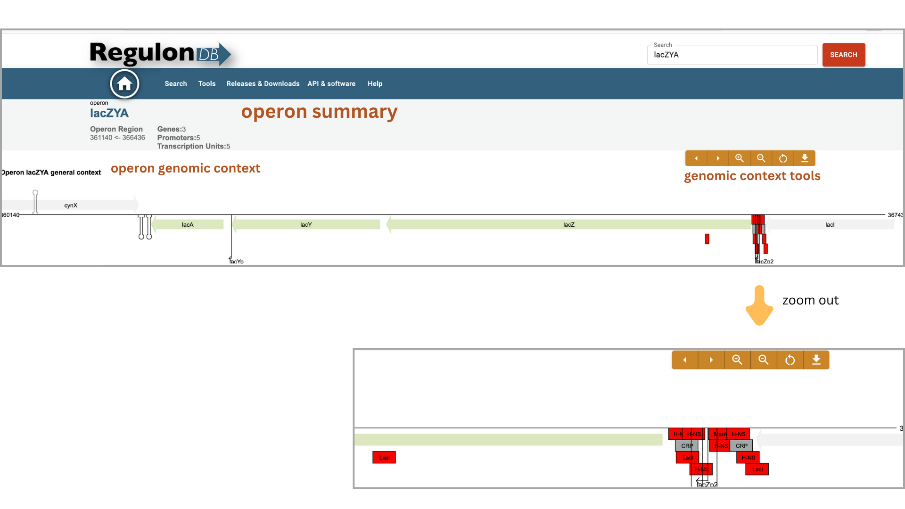
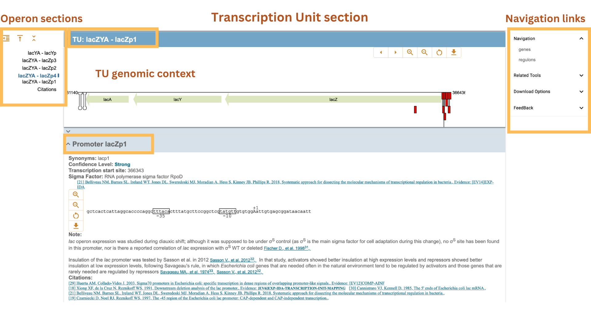
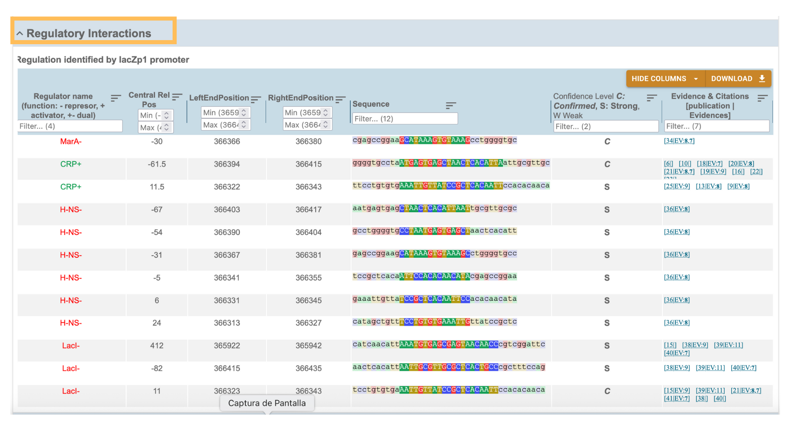
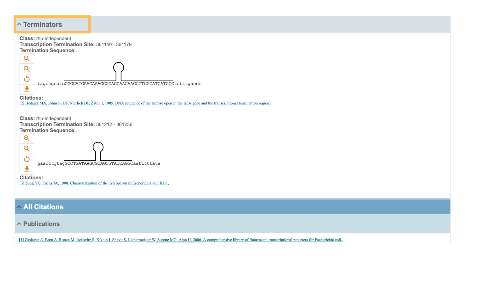

# 🧬 Operon Search Guide

Welcome to the **Operon Search Guide** of RegulonDB.

This guide explains how to retrieve operon-related information using the **global search bar** or the **operon catalog** in the RegulonDB web interface.

## 📚 How Operon Search Works

RegulonDB uses a **unified search system** where operons can be queried using different fields. When a term matches an operon (by name, ID, associated gene, promoter, or transcription unit), the result will be listed under the **Operon** category.

| Field             | Description |
|:------------------|:------------|
| **Operon Name**      | Commonly accepted name (e.g., `lac`, `araBAD`). |
| **RegulonDB ID**     | Unique operon identifier (e.g., `RDBECOLIOPC03373`). |
| **Promoter Name**    | Associated promoter names (e.g., `lacZp1`, `araBp`). |
| **Transcription Unit Name** | TU name in the format: `genes - promoter` (e.g., `lacZYA - lacZp1`). |
| **Gene Name**        | Any gene within the operon (e.g., `lacZ`, `araB`). |

You may use exact matches or combine fields using logical operators.

➡️ See [Using Logical Operators](logical_operators_search.md) for advanced search techniques.

## 🔎 How to Perform an Operon Search

1. Go to the RegulonDB homepage.
2. Enter your query (e.g., `lacZYA` or `lacYA` or `lacZp1` or `lacY` ) in the **Search Bar**.
3. Press the **Search** button.
4. Review the categorized results.
5. Click on an operon name to access the detailed page.

## 📋 Information Available on an Operon Page

When selecting an operon from the results (e.g., `lac`), you will find detailed, structured sections:

### 🧬 Basic Operon Information

- **Operon Summary**: 
	- **Operon Name**
	- **Genes included**
	- **Number of Promoters and Transcription Units**
	- **Genomic location** (coordinates and strand)

### 🧬 Transcription Units (TUs)
Each operon may include one or more transcription units with this structure:

- TU Name: `genes - promoter`
- Genes included (e.g., `lacZYA`)
- Promoter (e.g., `lacZp1`)
- Transcription start site (TSS)
- Strand and distance to first gene

Examples of TUs in the lac operon:

- `lacYA - lacYp`
- `lacZYA - lacZp1`, `lacZp2`, `lacZp3`, `lacZp4`

#### 🎯 Promoter Details
- Promoter name and synonyms
- Sigma factor
- TSS and core promoter sequences (-10, -35 boxes)
- Confidence level and supporting evidence
- Downloadable sequence

#### ⚙️ Regulatory Interactions

Table showing:
- Regulators (e.g., `LacI`, `CRP`)
- Role: activator (+), repressor (−), or dual (±)
- Position relative to promoter
- Binding site sequence

#### ⛔ Terminators

- Type: rho-independent or dependent
- Coordinates and stem-loop structure
- Termination sequence

### 📚 Citations
All references supporting the annotations of the operon, promoters, and regulatory elements.

---

## 🧪 Operon Search Examples

| Search Term                  | Expected Result                              |
|-----------------------------|----------------------------------------------|
| `lac operon`                | Full lac operon entry                        |
| `lacZp1 operon`             | Operon associated with promoter `lacZp1`     |
| `lacZYA - lacZp3 operon`    | Operon from TU `lacZYA - lacZp3`             |
| `lacA operon`               | Operon containing gene `lacA`                |
| `RDBECOLIOPC03373`          | Specific operon by RegulonDB ID              |
| `_operon_`                  | Full list of operons in the catalog          |

---

## 🛠️ Tips for Effective Operon Searches

- If you're unsure of the exact name, try searching by associated gene or promoter.
- You can explore the **Operon Catalog** to browse all available entries.
- Combine keywords with logical operators to refine your query.

---

## 📬 Need Help?

If you have questions or need assistance with the operon search or navigation, please contact:

📧 [regulondb@ccg.unam.mx](mailto:regulondb@ccg.unam.mx)
