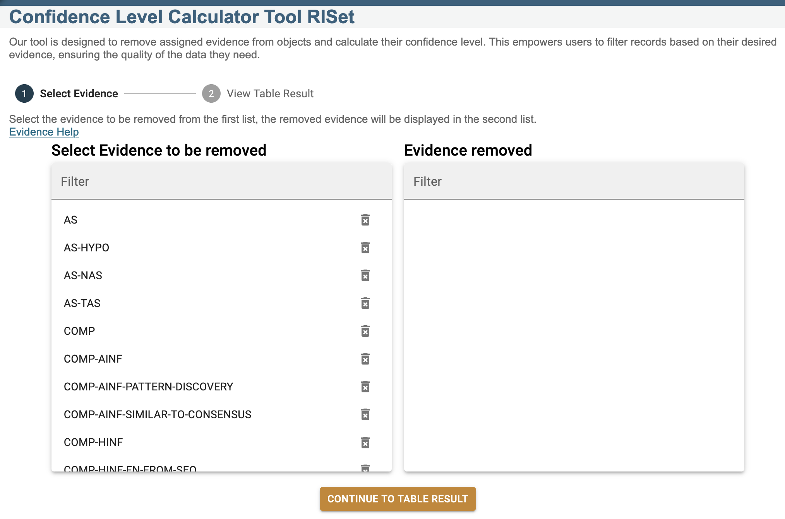
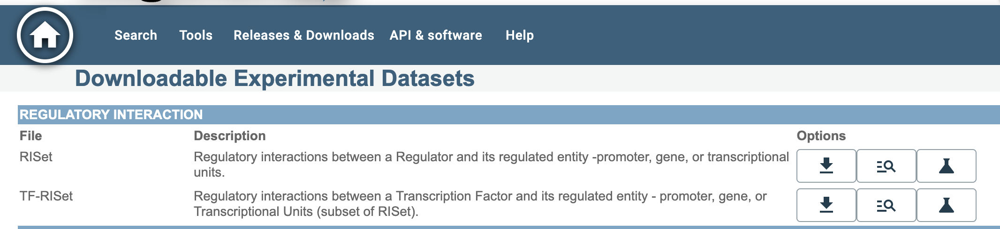

# Creating Gold Standard Datasets Using RegulonDB Tools

## Introduction

RegulonDB is a specialized database of regulatory interactions (RIs) in *E. coli* K-12. Each interaction is supported by experimental evidence types, grouped to assign a confidence level: **Weak (W)**, **Strong (S)**, or **Confirmed (C)**.

**Gold Standard datasets** are collections of highly reliable interactions. These are mainly used to benchmark new high-throughput (HT) technologies, such as ChIP-seq. RegulonDB provides interactive tools to create these datasets.

## Target Audience

This guide is for users with basic knowledge of molecular biology who want to generate high-confidence datasets from RegulonDB without requiring programming skills.

## Tools Used

### Browse & Filter Tool
This tool allows you to explore a dataset table and filter by columns. It is useful for selecting subsets based on confidence level, transcription factor (TF), evidence type, etc. The filtered result can be downloaded in TSV format.

### Confidence Level Calculator Tool
This tool lets you exclude specific types of evidence and then recalculates the confidence level for each interaction. Ideal for omitting HT methods (e.g., ChIP-seq) from the analysis.

   > *Figure 1.* Interface of the Confidence Level Calculator showing the selection and exclusion of evidence types.

The image above shows how users can exclude evidence types from the calculation. Selected items are moved from the left panel to the "Evidence removed" list on the right.

#### How the Confidence System Works
- Each RI may have **multiple pieces of evidence** from different experimental methods and publications.
- Each method is categorized as **Strong (S)** or **Weak (W)**.
- The overall confidence level (**W**, **S**, or **C**) is determined based on the collection of evidence.

#### Example Methods and Classifications

| Experimental Method                       | Category     |
|-------------------------------------------|--------------|
| EMSA (Electrophoretic Mobility Shift Assay) | Strong (S)   |
| DNase I Footprinting                       | Strong (S)   |
| ChIP-seq                                   | Weak (W)     |
| Computational inference (COMP-AINF)        | Weak (W)     |
| Reporter fusion transcription (AS-TAS)     | Strong (S)   |

The **Confidence Level Calculator Tool** lets users exclude one or more of these methods, and then recalculates the confidence level accordingly.

---

## Use Case 1: Obtain All Confirmed RIs (Level C)

### Steps

1. Go to [https://regulondb.ccg.unam.mx/datasets](https://regulondb.ccg.unam.mx/datasets)
2. Locate the dataset **TF-RISet**.
3. Click the magnifying glass icon (**Browse & Filter Tool**). 

  
   > **Figure 2.** Entry point to the Browse & Filter tool from the TF-RISet interface.

4. In the interactive table:
    - Locate column "20) confidenceLevel".
    - Filter by value "C" (Confirmed).

5. (Optional) Add more filters:
    - Transcription factor name
    - Presence/absence of HT evidence
    - Regulatory effect type

6. Click the **Download** button to save the filtered dataset.

> **Note**: To include both **Strong (S)** and **Confirmed (C)** interactions, repeat the steps and merge the resulting files manually.

---

## Use Case 2: Exclude Specific Evidence (e.g., ChIP-seq)

### Steps

1. Go to [https://regulondb.ccg.unam.mx/datasets](https://regulondb.ccg.unam.mx/datasets)
2. Locate the dataset **TF-RISet**.
3. Click the **Confidence Level Calculator Tool** icon.

4. Uncheck the evidence types you want to exclude (e.g., **EXP-CHIP-SEQ-MANUAL**).
5. Click **CONTINUE TO TABLE RESULT**.
6. In the resulting table:
    - Filter column "20) confidenceLevel" by "C".
    - (Optional) Add more filters.
7. Click the **Download** button to export the data.

---

## Example Subsets You Can Generate

Before choosing a tool, consider these guiding questions. The table below presents example subsets and the user question each one answers:

| Subset Name               | Tool Used           | Filters Applied                                  | Question Answered                                    |
|--------------------------|---------------------|--------------------------------------------------|-------------------------------------------------------|
| Confirmed RIs            | Browse & Filter     | Column 20 = C                                     | Do I want only the highest-confidence interactions?   |
| Strong + Confirmed       | Browse & Filter + merge | Column 20 = S or C                             | Should I include strong but not confirmed RIs too?    |
| Confirmed excluding ChIP-seq | Confidence Calculator | Uncheck ChIP-seq + Column 20 = C             | Do I want to exclude HT evidence like ChIP-seq?       |
| Classical method RIs     | Browse & Filter     | Use columns 21/22                                 | Do I want only manually curated/classical methods?    |
| Custom-defined confidence| Confidence Calculator | Customize evidence selection                    | Do I have my own criteria for experimental reliability?|

> **[Suggested Image]**: example filtered table showing evidence annotations.
> **Figure 3.** Example of filtered results table using RegulonDB's interactive tools.

---

## Final Notes

- Downloads are in **TSV** format, readable by Excel, R, or Python.
- For questions or support, contact: [regulondb@ccg.unam.mx](mailto:regulondb@ccg.unam.mx)

---

## Reference

Lara P, Gama-Castro S, Salgado H, et al. (2024). Flexible gold standards for transcription factor regulatory interactions in *E. coli* K-12: architecture of evidence types. *Front Genet*, 15:1353553. [PMCID: PMC10949920](https://www.ncbi.nlm.nih.gov/pmc/articles/PMC10949920/).

