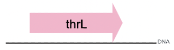
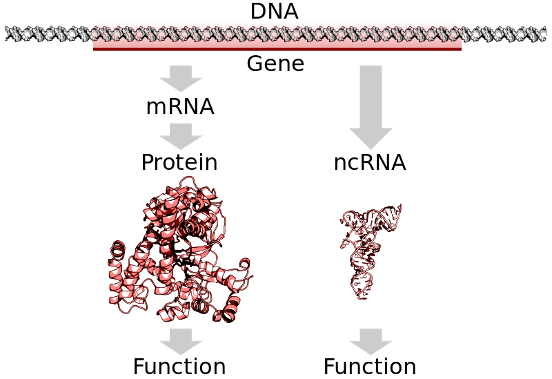
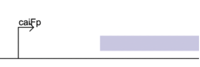
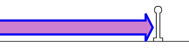
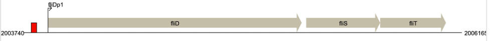

# Gene (Gen)

## 2. Definición simple

Un **gen** es una región continua de ADN que contiene la información necesaria para producir al menos un producto funcional, como un RNA o una proteína.

## 3. Definición extendida

En RegulonDB, un **gen** es una región de ADN mayor a cero nucleótidos que codifica uno o más productos funcionales. Estos productos pueden incluir RNAs funcionales (tRNA, rRNA, sRNA, etc.) o proteínas. La definición contempla casos complejos como:

* inicio de traducción alternativo,
* marcos de lectura alternativos,
* cambios de marco (frameshifting),
* procesamiento de RNA.

RegulonDB también registra genes sin productos funcionales actuales (pseudogenes o phantom genes) para preservar coherencia histórica.

## 4. Acrónimos y sinónimos relevantes

* gene
* genetic locus (histórico, no recomendado)
* ORF (relacionado, pero no equivalente)

## 5. Propiedades mínimas del objeto

| Propiedad      | Descripción                            | Requerida | Ejemplo      |
| -------------- | -------------------------------------- | --------- | ------------ |
| position left  | posición absoluta inicial en el genoma | sí        | 190          |
| position right | posición absoluta final en el genoma   | sí        | 255          |
| strand         | hebra del ADN donde se ubica el gen    | sí        | forward      |
| sequence       | secuencia del gen                      | sí        | ATGAAACGC... |
| synonyms       | otros nombres asociados                | no        | EG11277      |

## 6. Representación gráfica del objeto

En RegulonDB, un gen se visualiza como un rectángulo orientado según la hebra (forward/reverse). La dirección indica el sentido de transcripción. Los genes suelen mostrarse contiguos dentro de operones o aislados.

.  
Figure. Graphical representation of DNA region with a gene. RegulonDB´s Drawing Traces Tool [image].

## 7. Comments (Notas importantes)

* Un gen es una unidad informacional del genoma.
* No todos los genes pertenecen a operones.
* La regulación no ocurre a nivel de gen, sino a nivel de promotores, TUs y operones.
* Genes con múltiples productos representan adecuadamente fenómenos como isoformas proteicas o RNAs procesados.

## 8. Ejemplos

**Ejemplo simple:** un gen proteico típico con un único producto.

**Ejemplo complejo:** *dnaX*, que produce las proteínas tau y gamma mediante frameshifting.

## 9. Conexiones conceptuales

* **Gene → Product:** un gen genera uno o más productos.
* **Gene → Transcription Unit:** el gen puede estar contenido en una o varias TUs.
* **Gene ≠ CDS:** un gen puede tener varias CDS asociadas si produce isoformas.
* **Gene ≠ Regulador:** un gen puede codificar un regulador, pero el concepto no es equivalente.

## 10. Errores comunes o confusiones del usuario

* Confundir gen con CDS.
* Asumir que todos los genes están regulados por un único promotor.
* Pensar que el gen es la unidad de regulación. No lo es.

## 11. Referencias

* Mejía-Almonte et al., 2020. Redefining fundamental concepts of transcription initiation in bacteria.

## 12. Useful links

- Gene product (Wikipedia): https://en.wikipedia.org/wiki/Gene_product
- Biology Online – Gene Product: https://www.biologyonline.com/dictionary/gene-product
- UniProt (proteins): https://www.uniprot.org
- Rfam (functional RNAs): https://rfam.org

## 13. Historial del concepto

La definición se ha mantenido estable, pero RegulonDB ha extendido su representación para capturar:

* genes con múltiples productos,
* pseudogenes,
* phantom genes.

---

# Product (Producto Génico)

## 2. Definición simple

Un **producto génico** es la molécula funcional derivada de un gen: un RNA funcional o una proteína.

## 3. Definición extendida

En RegulonDB, un **product** es la molécula final funcional generada durante la expresión de un gen. Puede ser:

* Un **RNA funcional** (tRNA, rRNA, sRNA, tmRNA, etc.)
* Una **proteína**, incluyendo isoformas originadas por:

  * codones de inicio alternativos,
  * marcos alternativos de lectura,
  * procesamiento postraduccional.

**Importante:** El **mRNA no se considera un producto funcional**, sino un intermediario. Solo los RNAs con función propia se consideran productos.

## 4. Acrónimos y sinónimos relevantes

* gene product
* protein product
* RNA product

## 5. Propiedades mínimas del objeto

| Propiedad         | Descripción                            | Requerida | Ejemplo           |
| ----------------- | -------------------------------------- | --------- | ----------------- |
| product name      | nombre del producto                    | no        | ApaG              |
| gene id           | identificador del gen que lo produce   | sí        | RDBECOLIGNC00043  |
| sequence          | secuencia proteica o RNA funcional     | sí        | MKRISTTIT...      |
| product type      | tipo de producto (protein, sRNA, tRNA) | no        | small RNA         |
| molecular weight  | peso molecular estimado                | no        | 13.867 kDa        |
| cellular location | localización celular                   | no        | periplasmic space |

## 6. Representación gráfica del objeto

En RegulonDB, los productos no se visualizan directamente en el mapa genómico, pero aparecen como:

* entidades en paneles de información del gen,
* participantes en reacciones,
* componentes de complejos,
* elementos dentro de los GENSOR Units.

.   
Figure. Gene Definition. Biology Online of Digital Ventures Corporation URL: https://www.biologyonline.com/dictionary/gene.

## 7. Comments (Notas importantes)

* Un mismo gen puede producir múltiples productos.
* La versatilidad de un producto depende de su secuencia y modificaciones.
* Algunos productos funcionan como **reguladores** (TFs, sRNAs), pero no todos.
* Los productos proteicos pueden incluir isoformas no triviales.

## 8. Ejemplos

**Ejemplo simple:** Producto proteico único derivado de un gen típico.

**Ejemplo complejo:** *dnaX* → tau y gamma mediante frameshift.

## 9. Conexiones conceptuales

* **Product → Function:** cada producto tiene funciones moleculares.
* **Product → Complex:** los productos son componentes de complejos.
* **Product → GENSOR Unit:** los productos participan en reacciones y respuestas.
* **Product ≠ mRNA:** el mRNA no es producto final.

## 10. Errores comunes

* Creer que mRNA es un producto funcional.
* Pensar que un gen siempre produce un solo producto.
* Confundir producto con gen, CDS o regulador.

## 11. Referencias

* Gene product. Wikipedia.
* Gama-Castro et al., RegulonDB.

## 12. Useful links

- Gene product (Wikipedia): https://en.wikipedia.org/wiki/Gene_product
- Biology Online – Gene Product: https://www.biologyonline.com/dictionary/gene-product
- UniProt (proteins): https://www.uniprot.org
- Rfam (functional RNAs): https://rfam.org

## 13. Historial del concepto

El concepto de producto se amplió para capturar isoformas proteicas y RNAs funcionales adicionales.

La definición se ha mantenido estable, pero RegulonDB ha extendido su representación para capturar:

* genes con múltiples productos,
* pseudogenes,
* phantom genes.

---

# Promoter (Promotor)

## 2. Definición simple
Un **promotor** es una región específica del ADN donde la ARN polimerasa holoenzima (Eσ) se une para iniciar la transcripción. Define el punto donde comienza un RNA (TSS) y determina qué genes o unidades transcripcionales pueden expresarse.

## 3. Definición extendida
En RegulonDB, un **promoter** es una región de ADN reconocida por una holoenzima compuesta por la ARN polimerasa y un factor sigma específico. Su función es guiar a la enzima hacia el sitio donde se inicia la transcripción, definido por el nucleótido +1 o **Transcription Start Site (TSS)**.

Los promotores presentan elementos característicos, tales como:
- **Cajas de reconocimiento** (-10 y -35 para σ70, -12/-24 para σ54),
- **Elementos extendidos**, como la región extendida -10,
- **Elementos UP**, que potencian la afinidad con la ARN polimerasa,
- **Regiones discriminadoras**, asociadas a respuestas específicas como la limitación de aminoácidos.

Un mismo TSS puede estar asociado a **diferentes promotores**, cuando distintos sigma factores reconocen elementos superpuestos (ej. glmY). A la inversa, un promotor puede presentar múltiples TSS dentro de una ventana de ±5 nucleótidos debido a la variabilidad natural en la apertura del complejo de iniciación.

En RegulonDB, el nombre del promotor deriva del **primer gen transcrito**, seguido de una “p”.

## 4. Acrónimos y sinónimos relevantes
- promoter
- promoter region
- transcription initiation site (a veces usado de forma imprecisa)
- sigma factor recognition site

## 5. Propiedades mínimas del objeto
| Propiedad | Descripción | Requerida | Ejemplo |
|-----------|-------------|-----------|---------|
| promoter name | Nombre asignado por RegulonDB | sí | caiFp |
| sigma factor | Factor sigma que reconoce el promotor | sí | sigma70 |
| TSS | Posición genómica del sitio de inicio de transcripción (+1) | sí | 34218 |
| sequence | Secuencia del promotor, con el +1 en mayúsculas | sí | gatgacata...Atccacaa |
| strand | Hebra del ADN donde se localiza el promotor | sí | forward |
| boxes | Elementos de reconocimiento sigma (-10, -35, etc.) | no | ctcaca / tactat |

## 6. Representación gráfica del objeto
En RegulonDB, un promotor se muestra como un pequeño símbolo triangular o una marca direccional indicando el sitio de inicio de transcripción. Se representa inmediatamente antes de las unidades transcripcionales y genes regulados.

Los sitios -10, -35 y otros elementos pueden visualizarse en paneles detallados. Los promotores superpuestos se representan como múltiples símbolos en la misma posición genómica con diferentes identificadores de sigma factor.

.  
Figure: Graphical representation of a promoter. RegulonDB´s Drawing Traces Tool.

## 7. Comments (Notas importantes)
- Un promotor regula **una unidad transcripcional (TU)**, no necesariamente un solo gen.
- Diferentes promotores pueden compartir el mismo TSS.
- Un gen puede tener múltiples promotores, lo que permite expresión diferencial.
- Los promotores pueden estar superpuestos o incluso ubicarse dentro de operones complejos.
- No todos los promotores presentan motivo -10/-35 canónicos.
- Factores sigma alternativos definen clases funcionales de promotores.

## 8. Ejemplos
**Ejemplo simple (σ70):**  
Promotor bien definido con cajas -10 y -35 conservadas y un único TSS predominante.

**Ejemplo complejo (promotores superpuestos):**  
El gen glmY presenta promotores reconocidos por σ70 y σ54 que comparten el mismo TSS, definiéndose como promotores distintos.

## 9. Conexiones conceptuales
- **Promoter → TU:** determina el inicio de la unidad transcripcional.
- **Promoter ↔ Sigma factor:** cada promotor está asociado a un sigma específico.
- **Promoter ↔ Regulatory Sites (TFRS):** los promotores pueden ser blanco de activadores o represores.
- **Promoter → Operon:** un operón puede tener varios promotores que generan transcritos alternativos.
- **Promoter ≠ TSS:** el TSS es parte del promotor, pero no es el promotor.

## 10. Errores comunes
- Confundir el promotor con la región upstream del gen.
- Asumir que un promotor regula un único gen.
- Pensar que todos los promotores tienen cajas -10/-35 perfectamente conservadas.
- Igualar TSS a promotor.

## 11. Referencias
- Mejía-Almonte C, et al. 2020. *Redefining fundamental concepts of transcription initiation in bacteria*. Nature Reviews Genetics. https://doi.org/10.1038/s41576-020-0254-8

## 12. Useful links
- Wikipedia – Promoter: https://en.wikipedia.org/wiki/Promoter_(genetics)
- Biology Online – Promoter: https://www.biologyonline.com/dictionary/promoter
- RegulonDB – Ejemplos de promotores: https://regulondb.ccg.unam.mx

## 13. Historial del concepto
- Originalmente se definía solo por cajas -10/-35.
- A partir de 2020, incorporó nuevas regiones funcionales y la posibilidad de múltiples TSS.
- Se oficializó la distinción entre promotores que comparten TSS pero reconocen distintos sigma factores.

---

# Terminator (Terminador)

## 2. Definición simple
Un **terminador** es una región del ADN donde la ARN polimerasa detiene la transcripción y libera el RNA recién sintetizado. Marca el final de una unidad transcripcional.

## 3. Definición extendida
En RegulonDB, un **terminator** es una región genómica que provoca la terminación de la transcripción por uno de dos mecanismos principales:

- **Terminadores independientes de Rho (rho-independent o intrínsecos)**: contienen una secuencia invertida rica en GC que forma una horquilla en el RNA, seguida de una cola de U en la molécula de RNA, lo que desestabiliza el complejo de transcripción.
- **Terminadores dependientes de Rho (rho-dependent)**: requieren la acción de la proteína Rho, una helicasa que persigue al RNA polimerasa y promueve la disociación del complejo.

Los terminadores delimitan el final de una **unidad transcripcional (TU)**, pero no necesariamente del último gen transcrito. Un terminador puede estar asociado a más de una TU, especialmente en operones complejos.

## 4. Acrónimos y sinónimos relevantes
- terminator
- TTS (Transcription Termination Site)
- intrinsic terminator (rho-independent)
- rho-dependent terminator

## 5. Propiedades mínimas del objeto
| Propiedad | Descripción | Requerida | Ejemplo |
|-----------|-------------|-----------|---------|
| left position | inicio de la región del terminador | sí | 274 |
| right position | fin de la región del terminador | sí | 310 |
| strand | hebra donde ocurre la terminación | sí | forward |
| sequence | secuencia del terminador | sí | ggaaacacagAAAAAAG..GGCTTTTTTTTTcgaccaaagg |
| type | tipo de terminación | sí | rho-independent |
| transcriptionUnit(s) | TU(s) afectadas | no | thrLABC |

## 6. Representación gráfica del objeto
En RegulonDB, los terminadores se muestran como un símbolo de "T" invertida o figura similar que indica el final de una TU. Pueden aparecer:
- como límites finales de un operón,
- como terminadores internos en operones complejos,
- asociados a múltiples unidades transcripcionales.

## 7. Comments (Notas importantes)
- Un terminador no está asociado a un solo gen, sino a **una o más TUs**.
- Existen terminadores internos que generan transcritos alternativos en operones complejos.
- La eficiencia de terminación puede variar; algunos terminadores permiten **readthrough**.
- Los terminadores intrínsecos son los más fácilmente predecibles computacionalmente.
- Los terminadores dependientes de Rho requieren evidencia experimental o inferencias basadas en características de secuencia.
- Los atenuadores son un caso especial de terminadores regulados por traducción de un péptido líder.

## 8. Ejemplos
**Ejemplo simple:** 
Un terminador rho-independent con horquilla GC y cola de U.

**Ejemplo complejo:** 
El terminador asociado al operón *thrLABC*, que funciona como límite para múltiples TUs.

## 9. Conexiones conceptuales
- **Promoter → Terminator:** ambos delimitan una TU.
- **Terminator → TU:** determina dónde termina una unidad transcripcional.
- **Terminator → Operon:** un operón puede tener múltiples terminadores internos.
- **Terminator vs Attenuator:** el atenuador es un terminador regulado cuyo funcionamiento depende de la traducción del péptido líder.
- **Terminator ≠ sitio regulatorio:** no media unión de factores, aunque su estructura influye en la regulación.

## 10. Errores comunes
- Creer que el terminador corresponde a un gen específico.
- Pensar que el terminador está siempre al final de un operón.
- Asumir que todos los terminadores son intrínsecos.
- Considerar el terminador como un único nucleótido en lugar de una región.

## 11. Referencias
- Terminación de la transcripción. *Biology Online*: https://www.biologyonline.com/dictionary/termination
- O'Neill et al., 2020. *Mechanisms of bacterial transcription termination*. Trends in Microbiology. https://doi.org/10.1016/j.tim.2020.02.002

## 12. Useful links
- Terminator (Wikipedia): https://en.wikipedia.org/wiki/Terminator_(genetics)
- RegulonDB: Ejemplos de terminadores https://regulondb.ccg.unam.mx

## 13. Historial del concepto
- La identificación de terminadores intrínsecos se estableció inicialmente mediante predicción de estructuras secundarias.
- Con el tiempo, se reconoció la importancia de los terminadores dependientes de Rho.
- RegulonDB incorpora ambos tipos cuando existe evidencia experimental o computacional sólida.

---

# Transcription Unit (TU) — Unidad Transcripcional

## 2. Definición simple
Una **unidad transcripcional (TU)** es un segmento del ADN que se transcribe como una sola molécula de RNA, iniciando en un **promotor** específico y terminando en un **terminador** específico.

## 3. Definición extendida
En RegulonDB, una **TU** se define como la región del genoma transcrita por la ARN polimerasa a partir de un promotor identificado y que finaliza en un terminador anotado. Una TU puede incluir:
- uno o varios genes (monocistrónica o policistrónica),
- regiones UTR 5’ y 3’,
- elementos intergénicos,
- sRNAs,
- e incluso terminadores internos cuando existe evidencia de readthrough.

Un mismo operón puede dar lugar a **múltiples TUs**, dependiendo de qué promotor(es) se utilicen y de si existen terminadores alternativos. La TU representa la **unidad funcional de expresión transcripcional**, a diferencia del gen, que es una unidad informacional.

## 4. Acrónimos y sinónimos relevantes
- TU
- transcription unit
- unidad transcripcional
- transcrito primario (no recomendado como sinónimo estricto)

## 5. Propiedades mínimas del objeto
| Propiedad | Descripción | Requerida | Ejemplo |
|-----------|-------------|-----------|---------|
| TU name | nombre asignado según convención RegulonDB | sí | thrLABC-TU1 |
| promoter(s) | promotor(es) que inician la TU | sí | thrLp |
| terminator(s) | terminador(es) donde finaliza la TU | sí | thrLt |
| genes | genes contenidos en la TU | sí | thrL, thrA, thrB, thrC |
| strand | hebra donde se transcribe la TU | sí | forward |
| operon | operón al que pertenece la TU | no | thrLABC |

## 6. Representación gráfica del objeto
En RegulonDB, la TU aparece como una **flecha larga** que se extiende desde su promotor hasta su terminador. Las TUs de un mismo operón pueden visualizarse como flechas paralelas o superpuestas, mostrando las variantes transcripcionales.

## 7. Comments (Notas importantes)
- Una TU puede ser **monocistrónica** (un solo gene) o **policistrónica** (varios genes).
- Un mismo gene puede aparecer en **múltiples TUs**, dependiendo de los promotores alternativos.
- La TU es la **unidad funcional** sobre la cual actúan la mayoría de los mecanismos regulatorios.
- Las TUs pueden cambiar con nueva evidencia experimental que redefina sus promotores o terminadores.
- En operones complejos, la existencia de terminadores internos crea TUs parciales.

## 8. Ejemplos

**Ejemplo simple:** TU monocistrónica que expresa únicamente un sRNA.

**Ejemplo policistrónico:** TU del operón *lacZYA*, que incluye tres genes.

**Ejemplo complejo:** Operón *thrLABC*, con múltiples TUs derivadas de promotores alternativos y terminadores compartidos.

## 9. Conexiones conceptuales
- **Promoter → TU → Terminator:** forma la unidad básica de transcripción.
- **TU → Operon:** un operón puede contener varias TUs.
- **TU → Genes:** define qué genes se expresan juntos.
- **TU y Regulación:** activadores y represores actúan sobre el promotor y, por extensión, sobre la TU.

## 10. Errores comunes
- Confundir TU con operón.
- Asumir que un gen pertenece a una sola TU.
- Pensar que todas las TUs se expresan necesariamente de forma continua.
- Igualar TU con “lo que se observa en RNA-seq”; RegulonDB usa evidencia curada específica.

## 11. Referencias
- Browning & Busby. 2004. *The regulation of bacterial transcription initiation*. Nature Reviews Microbiology. https://doi.org/10.1038/nrmicro820
- Cho et al. 2014. *Transcription unit architecture in bacteria*. Microbiology Spectrum. https://doi.org/10.1128/microbiolspec.MDNA3-0012-2014

## 12. Useful links
- Wikipedia – Transcription unit: https://en.wikipedia.org/wiki/Transcription_unit
- Biology Online – Transcription unit: https://www.biologyonline.com/dictionary/transcription-unit
- RegulonDB – Lista de TUs: https://regulondb.ccg.unam.mx/

## 13. Historial del concepto
- En definiciones clásicas, una TU se describía simplemente como “uno o más genes transcritos juntos”.
- Con evidencia moderna (TSS, terminadores, RNA-seq), la definición pasó a ser una entidad basada en evidencia experimental precisa.
- RegulonDB adoptó el modelo de múltiples TUs por operón para reflejar la complejidad real de la transcripción bacteriana.

---

# Operon (Operón)

## 2. Definición simple
Un **operón** es un conjunto de uno o más genes consecutivos en la misma hebra del ADN que pueden transcribirse coordinadamente como parte de una o más unidades transcripcionales (TUs).

## 3. Definición extendida
En RegulonDB, un **operón** es una entidad genómica compuesta por genes contiguos orientados en la misma hebra y que están funcionalmente relacionados. Estos genes pueden ser expresados por una o varias **unidades transcripcionales (TUs)** iniciadas desde promotores asociados al operón.

A diferencia de definiciones clásicas, un operón puede contener **múltiples TUs**, debido a la presencia de:
- promotores alternativos,
- terminadores internos,
- regulación diferencial dependiente de condiciones.

El operón es por lo tanto una estructura **genómica y organizacional**, mientras que la TU es una estructura **transcripcional**.

## 4. Acrónimos y sinónimos relevantes
- operon
- operón
- transcriptional cluster (término histórico, no recomendado)

## 5. Propiedades mínimas del objeto
| Propiedad | Descripción | Requerida | Ejemplo |
|-----------|-------------|-----------|---------|
| operon name | nombre del operón | sí | thrLABC |
| genes | genes consecutivos en la misma hebra | sí | thrL, thrA, thrB, thrC |
| strand | hebra en la que están los genes | sí | forward |
| TUs | unidades transcripcionales asociadas | sí | thrLABC-TU1, thrLABC-TU2 |
| first gene | primer gen del operón | sí | thrL |

## 6. Representación gráfica del objeto
En RegulonDB, el operón aparece como un marco o región que contiene los genes orientados en la misma dirección. Debajo o encima se representan las **TUs**, que pueden depender de diferentes promotores y terminadores. Los promotores y terminadores se muestran como símbolos específicos conectados a las TUs.

Los operones complejos muestran múltiples TUs superpuestas, reflejando su arquitectura transcripcional real.

## 7. Comments (Notas importantes)
- Un operón puede tener **uno o múltiples promotores**.
- Un operón puede tener **uno o múltiples terminadores**, incluso **internos**.
- Un operón puede contener **varias TUs**, que expresan distintos subconjuntos de genes.
- El operón NO es equivalente a un regulón.
- Un operón no garantiza que todos sus genes se expresen juntos en todas las condiciones.

## 8. Ejemplos
**Ejemplo simple:** Operón monocistrónico con un solo gen, un promotor y un terminador.

**Ejemplo clásico:** Operón *lacZYA*, con tres genes regulados juntos bajo el control del represor LacI.

**Ejemplo complejo:** Operón *thrLABC*, con múltiples promotores, terminadores internos y varias TUs alternativas.

## 9. Conexiones conceptuales
- **Operon → Genes:** conjunto de genes consecutivos y orientados.
- **Operon → TUs:** puede originar múltiples unidades transcripcionales.
- **Operon → Regulación:** los factores reguladores actúan sobre los promotores que controlan las TUs del operón.
- **Operon ≠ TUs:** una TU es un transcrito, el operón es una organización genómica.
- **Operon ≠ Regulon:** un regulón es un conjunto de genes regulados por un mismo TF.

## 10. Errores comunes
- Asumir que un operón tiene una sola TU.
- Pensar que todos los genes del operón siempre se expresan juntos.
- Confundir operón con regulón.
- Interpretar que el operón termina automáticamente después del último gen (puede haber terminadores externos o internos).

## 11. Referencias
- Jacob F. & Monod J., 1961. *Genetic regulatory mechanisms in the synthesis of proteins*. Journal of Molecular Biology. https://doi.org/10.1016/S0022-2836(61)80072-7
- Browning & Busby. 2004. *The regulation of bacterial transcription initiation*. Nature Reviews Microbiology.

## 12. Useful links
- Operon (Wikipedia): https://en.wikipedia.org/wiki/Operon
- Biology Online – Operon: https://www.biologyonline.com/dictionary/operon
- RegulonDB – Lista de operones: https://regulondb.ccg.unam.mx

## 13. Historial del concepto
- En su definición original por Jacob y Monod, un operón representaba un conjunto de genes transcritos juntos.
- Con evidencia moderna (TSS, terminadores, RNA-seq), se reconoce que los operones pueden tener **múltiples TUs**.
- RegulonDB expandió el concepto para capturar operones complejos con promotores alternativos y terminadores internos.

---

